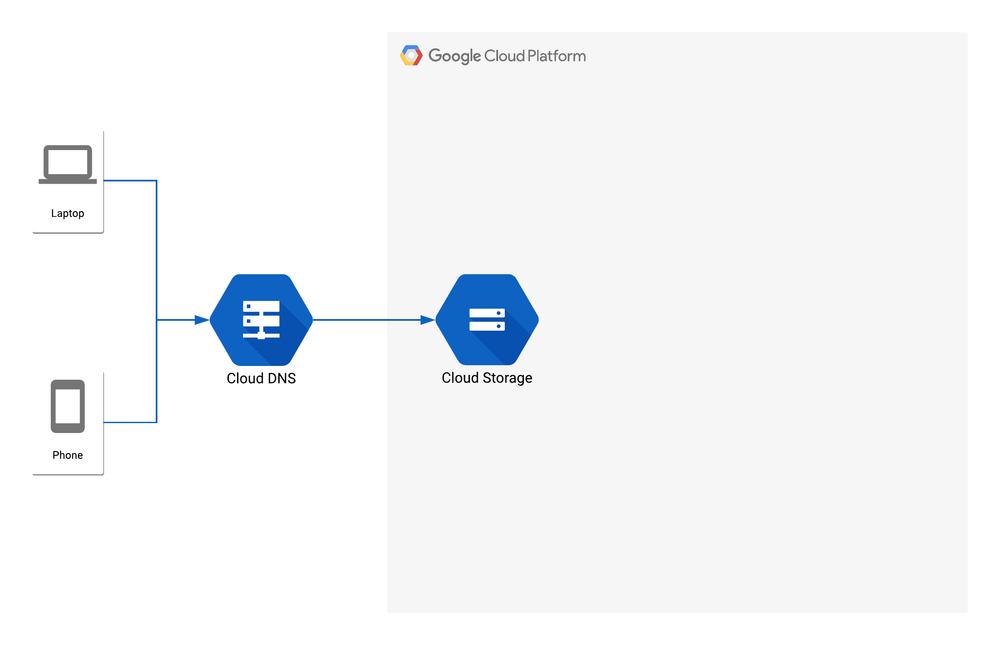

# terraform-google-storage-static-website
A Terraform Module for a static website hosted on Google Cloud Storage. 

This module will create a bucket and assign it the proper ACLs to host a static website. When using the module, the bucket name should be the domain name of the website that will be created. Also ensure that domain ownership has been verified before using the module.

## Usage

```HCL
module "google_storage_static_website" {
    source = "https://github.com/jdpleiness/terraform-google-storage-static-website"
    bucket_name = "your-website-domain-name"
    project_id = "your-project-id"
}
```



**Note:** Google Cloud Storage only supports HTTP. In order to serve your content through a custom domain over SSL you will need to [setup a load balancer][lb-link] or use a [third party content delivery network][cdn-link] with Cloud Storage.

[lb-link]: https://cloud.google.com/compute/docs/load-balancing/http/adding-a-backend-bucket-to-content-based-load-balancing
[cdn-link]: https://cloudplatform.googleblog.com/2015/09/push-google-cloud-origin-content-out-to-users.html